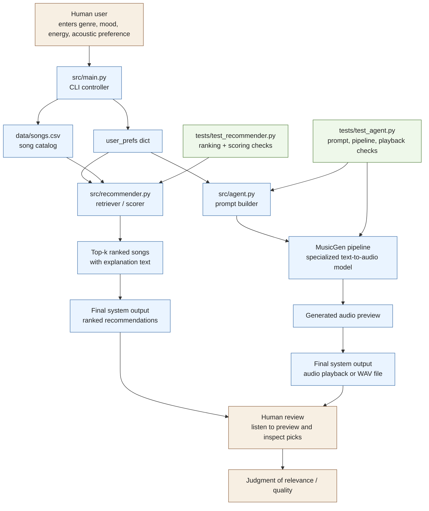

# VibeMatch — Project Overview

## What the project does

VibeMatch is a music recommendation system with two outputs for every query:

1. **A ranked list of songs** from an 18-song catalog that best match your preferences
2. **A freshly generated audio clip** (via MusicGen) that captures your requested vibe

These two things are independent — the song list comes from rule-based scoring, and the audio is synthesized from scratch by an AI model.

---

## How MusicGen is used (and what it does NOT do)

**MusicGen does NOT play songs from the catalog.**

It is a pretrained text-to-audio model (`facebook/musicgen-small`, released by Meta) that was trained specifically to generate music from text descriptions. When you pick "lofi / chill / energy 0.4 / acoustic", the system builds a prompt like:

```
"chill lofi music, acoustic and organic, moderate pace, 85 bpm"
```

MusicGen reads that prompt and synthesizes 5–15 seconds of completely original audio that matches it. Think of it as a live audio mood preview — not a recording of any real song.

This is why MusicGen qualifies as a **Specialized/Pretrained Model** AI feature: it is a model trained exclusively on music generation, not a general-purpose model.

---

## Project structure

```
applied-ai-system-project/
├── src/
│   ├── recommender.py   ← scoring engine + data loader
│   ├── agent.py         ← MusicGen integration
│   └── main.py          ← CLI entry point
├── data/
│   └── songs.csv        ← 18-song catalog
├── tests/
│   ├── test_recommender.py
│   └── test_agent.py
└── requirements.txt
```

---

## Component breakdown

### `src/recommender.py` — The scoring engine

Contains all the rule-based recommendation logic. No AI here — pure math.

**Key pieces:**
- `Song` dataclass — stores title, artist, genre, mood, energy, tempo, valence, danceability, acousticness
- `UserProfile` dataclass — stores the user's genre, mood, energy target, acoustic preference
- `score_song(user_prefs, song)` — scores one song against one user profile using weighted features:

| Feature | Weight | How it's measured |
|---|---|---|
| Genre match | +1.0 | Exact text match |
| Mood match | +1.0 | Exact text match |
| Energy similarity | up to +4.0 | `4.0 × (1 - abs(song_energy - target_energy))` |
| Acoustic preference | +0.5 | Song acousticness ≥ 0.5 matches `likes_acoustic=True` |

- `recommend_songs(user_prefs, songs, k=5)` — scores all songs, returns top-k with explanations
- `load_songs(csv_path)` — reads `data/songs.csv` into a list of dicts

---

### `src/agent.py` — MusicGen integration

Handles all audio generation. No scoring logic here — it delegates to `recommend_songs`.

**Key pieces:**

| Function | What it does |
|---|---|
| `_select_musicgen_device()` | Picks CUDA if available, CPU otherwise. Avoids Apple Silicon MPS kernel crashes. |
| `_get_musicgen_pipeline()` | Lazy-loads `facebook/musicgen-small` on first call (~300MB, cached after). |
| `_build_music_prompt(user_prefs)` | Translates genre/mood/energy/acoustic into a text string MusicGen can understand. |
| `_generate_and_play_music(prompt, duration_seconds)` | Runs MusicGen, plays audio via `sounddevice`, falls back to saving `vibe_preview.wav`. |
| `_format_recommendations(recs)` | Formats the scored song list into a readable numbered string (used in tests). |
| `run_recommendation_with_audio(user_prefs, songs)` | **Main entry point**: gets recommendations, prints them, builds a prompt, generates + plays audio. |

**How `_build_music_prompt` works:**

```python
# Input:  genre="lofi", mood="chill", energy=0.4, acoustic=True
# Output: "chill lofi music, acoustic and organic, moderate pace, 85 bpm"

# Input:  genre="metal", mood="intense", energy=0.9, acoustic=False
# Output: "intense metal music, electronic and produced, fast and intense, 160 bpm"
```

Energy maps to BPM and description:
- 0.0–0.3 → "very slow and gentle", 60 bpm
- 0.3–0.6 → "moderate pace", 85 bpm
- 0.6–0.8 → "upbeat and energetic", 120 bpm
- 0.8–1.0 → "fast and intense", 160 bpm

---

### `src/main.py` — CLI entry point

Two modes:

**Demo mode** (`python -m src.main`) — runs three hardcoded profiles and prints their top-5 recommendations. No audio generated. Good for quick testing.

**Interactive mode** (`python -m src.main --interactive`) — asks the user four questions, calls `run_recommendation_with_audio`, optionally loops.

```
Genres: lofi, pop, rock, synthwave, jazz, ambient, ...
Favorite genre: lofi

Moods: chill, happy, intense, focused, calm, ...
Current mood: chill

Energy level 0.0 (very calm) to 1.0 (intense) [0.5]: 0.4

Prefer acoustic music? (y/n) [n]: y
```

---

## Full data flow (interactive mode)

```
User answers 4 questions
        │
        ▼
   user_prefs dict
   { genre, mood, energy, acoustic }
        │
        ├──────────────────────────────────────────────┐
        │                                              │
        ▼                                              ▼
recommend_songs()                          _build_music_prompt()
(recommender.py)                           (agent.py)
        │                                              │
score all 18 songs                    "chill lofi music, acoustic
return top 5 with reasons              and organic, 85 bpm"
        │                                              │
        ▼                                              ▼
Print ranked list                      _generate_and_play_music()
                                       (agent.py)
                                               │
                                   MusicGen synthesizes audio
                                   locally, no internet needed
                                               │
                                       Play via sounddevice
                                       (or save to .wav)
```

---

## System diagram



This diagram maps your project to the common AI system pattern:
- `Retriever / scorer`: `src/recommender.py` ranks songs from the catalog.
- `Agent`: `src/agent.py` turns preferences into a MusicGen prompt and runs the model.
- `Evaluator / tester`: the human checks whether the picks and generated vibe feel right, while unit tests verify scoring, prompt construction, and agent behavior.

---

## AI feature category

This project satisfies the **Fine-Tuned / Specialized Model** category:

> "You use a model that's been trained or adjusted for a specific task."

`facebook/musicgen-small` is a model trained exclusively on music data to perform one task: generating music audio from text descriptions. It is not a general-purpose model — it cannot answer questions, write code, or do anything other than produce music.

---

## Setup and running

```bash
# Install dependencies (torch is ~2GB, one-time download)
pip install -r requirements.txt

# Demo mode — no dependencies beyond requirements
python -m src.main

# Interactive mode with audio generation
python -m src.main --interactive

# Run tests (no model download, everything is mocked)
python -m pytest tests/ -v
```

First time `--interactive` is used, MusicGen downloads ~300MB of model weights automatically and caches them. Subsequent runs are instant.
