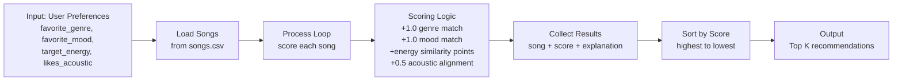
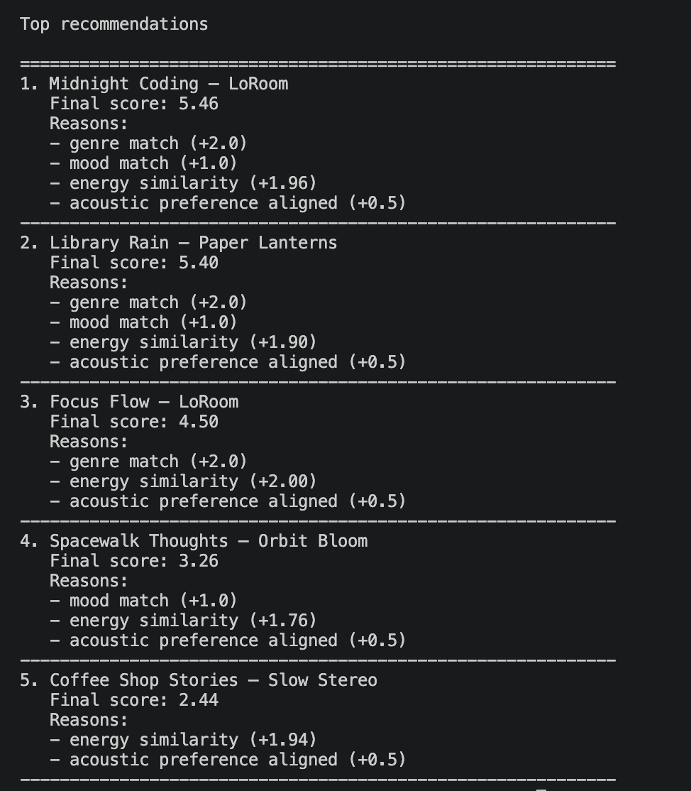
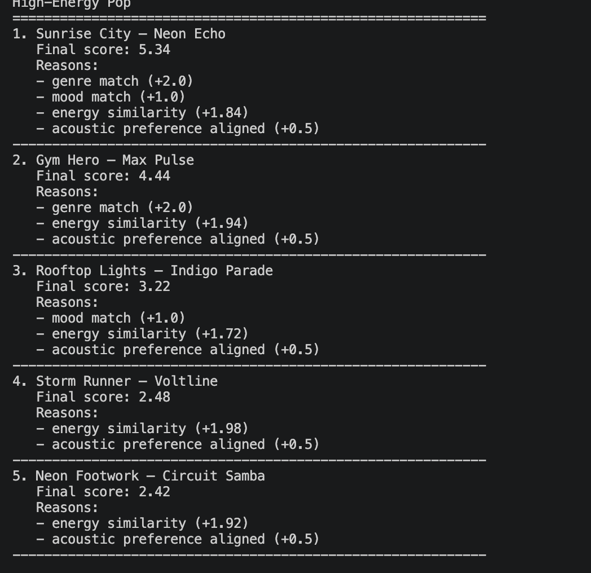
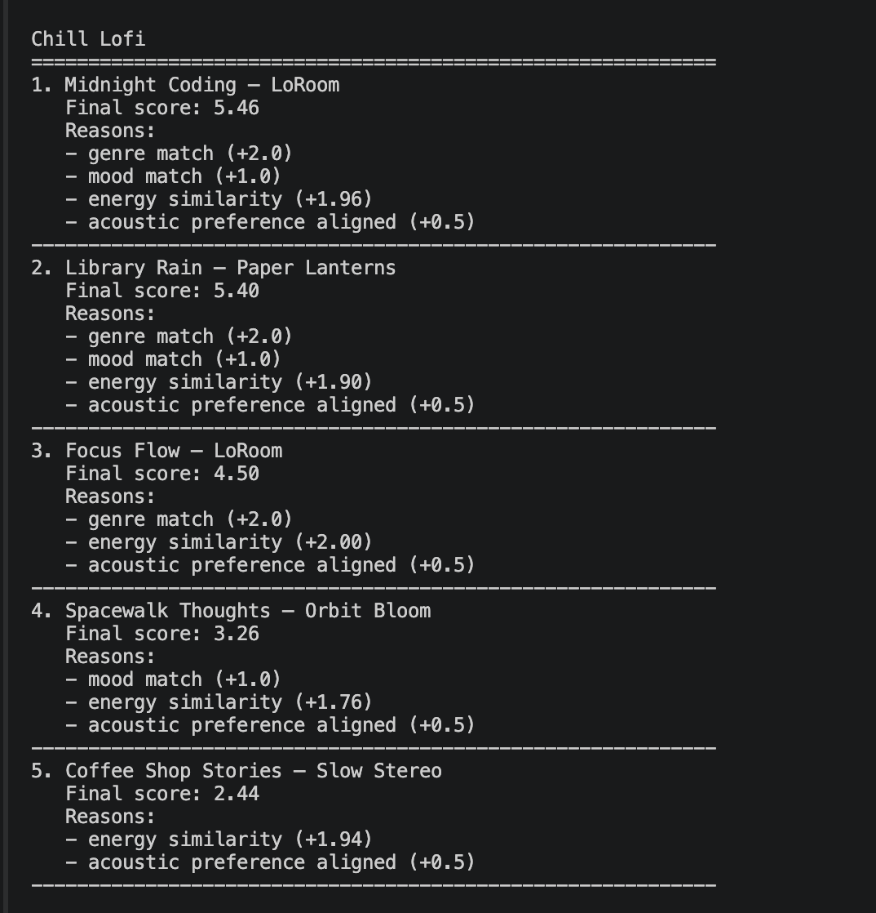
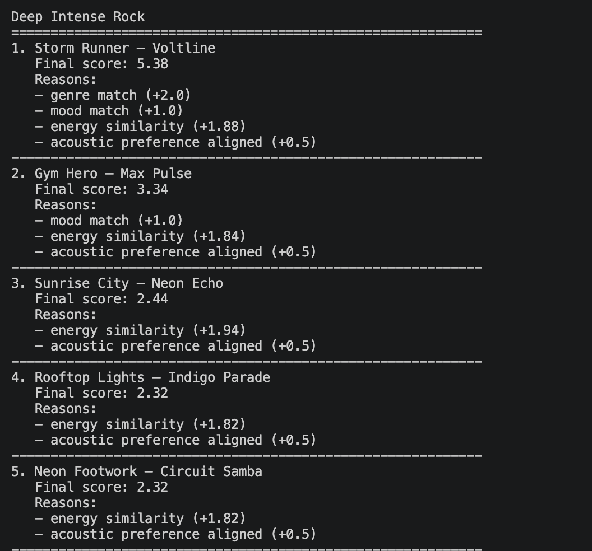

# 🎵 Music Recommender Simulation

## Project Summary

In this project you will build and explain a small music recommender system.

Your goal is to:

- Represent songs and a user "taste profile" as data
- Design a scoring rule that turns that data into recommendations
- Evaluate what your system gets right and wrong
- Reflect on how this mirrors real world AI recommenders

Replace this paragraph with your own summary of what your version does.
This version builds a transparent, content-based music recommender using a small song catalog.
It compares each song to a user taste profile using genre, mood, energy, and acoustic preference.
Songs are scored, sorted, and returned as top-k recommendations with short explanations.


---

## How The System Works

Explain your design in plain language.

Some prompts to answer:

- What features does each `Song` use in your system
  - For example: genre, mood, energy, tempo
- What information does your `UserProfile` store
- How does your `Recommender` compute a score for each song
- How do you choose which songs to recommend

You can include a simple diagram or bullet list if helpful.
->The recommender treats each song as a set of features and compares those features to a user's preferences.

Song features used in this simulation:
- id
- title
- artist
- genre
- mood
- energy
- tempo_bpm
- valence
- danceability
- acousticness

UserProfile features used in this simulation:
- favorite_genre
- favorite_mood
- target_energy
- likes_acoustic

Specific taste profile used for comparison:
- Listener type: calm late-night focus listener
- Preferred genre: lofi
- Preferred mood: chill
- Target energy: 0.40
- Acoustic preference: likes acoustic sounds

### Data Flow (Mermaid)



### Finalized Algorithm Recipe

For each song in the CSV, compute:

- Start with score = 0.0
- If song genre == favorite_genre, add +1.0
- If song mood == favorite_mood, add +1.0
- Add energy similarity points:
  - `energy_similarity = max(0.0, 1.0 - abs(song_energy - target_energy))`
  - `energy_points = 4.0 * energy_similarity`
  - Add `energy_points` to score
- If acoustic preference aligns (`likes_acoustic` with acousticness >= 0.5, or not likes_acoustic with acousticness < 0.5), add +0.5
- Sort all songs by final score (descending)
- Return top-k songs

### Potential Biases (Expected)

- This system may over-prioritize energy because energy now has the largest weight, which can push up songs with similar energy even when genre fit is weaker.
- The acoustic threshold (0.5) is a hard cutoff and can be overly simplistic for nuanced taste.
- With a small catalog, results may repeat similar songs and reduce diversity.
---


## Getting Started

### Setup

1. Create a virtual environment (optional but recommended):

   ```bash
   python -m venv .venv
   source .venv/bin/activate      # Mac or Linux
   .venv\Scripts\activate         # Windows

2. Install dependencies

```bash
pip install -r requirements.txt
```

3. Run the app:

```bash
python -m src.main
```

### Running Tests

Run the starter tests with:

```bash
pytest
```

You can add more tests in `tests/test_recommender.py`.

---

## Experiments You Tried

Use this section to document the experiments you ran. For example:

- What happened when you changed the weight on genre from 2.0 to 0.5
- What happened when you added tempo or valence to the score
- How did your system behave for different types of users
I tested multiple user profiles and compared the top 5 recommendations.
Profiles tested: High-Energy Pop, Chill Lofi, and Deep Intense Rock.

I also ran a weight-shift experiment.
I reduced genre weight and increased energy weight.
After this change, energy had a much stronger effect on ranking.
Songs with similar energy moved up even when genre match was weaker.

For behavior checks, I compared profile pairs.
Chill Lofi and Deep Intense Rock gave the clearest contrast.
Profiles with high target energy often shared some top songs.
This showed the scoring is sensitive to weight choices.





---

## Limitations and Risks

Summarize some limitations of your recommender.

Examples:

- It only works on a tiny catalog
- It does not understand lyrics or language
- It might over favor one genre or mood
#####
- It uses a small catalog, so recommendations are limited.
- It does not use lyrics, language, or listening history.
- Energy has high weight, so results can favor similar-energy songs.
You will go deeper on this in your model card.

---

## Reflection

Read and complete `model_card.md`:

[**Model Card**](model_card.md)

Write 1 to 2 paragraphs here about what you learned:

- about how recommenders turn data into predictions
- about where bias or unfairness could show up in systems like this
I learned that recommenders turn preferences into numbers, then rank items by score. In this project, small changes to feature weights changed the top results a lot. That made it clear how important scoring design is.

I also learned where bias can appear. A small dataset limits who gets good recommendations, and high energy weight can over-favor one style of song. Even simple rules can feel unfair when some user tastes are underrepresented.

---

## 7. `model_card_template.md`

Combines reflection and model card framing from the Module 3 guidance. :contentReference[oaicite:2]{index=2}  

```markdown
# 🎧 Model Card - Music Recommender Simulation

## 1. Model Name

Give your recommender a name, for example:

> VibeMatch Classroom Recommender v1.

---

## 2. Intended Use

- What is this system trying to do
- Who is it for

Example:

> This model suggests 3 to 5 songs from a small catalog based on a user's preferred genre, mood, and energy level. It is for classroom exploration only, not for real users.

---

## 3. How It Works (Short Explanation)

Describe your scoring logic in plain language.

- What features of each song does it consider
- What information about the user does it use
- How does it turn those into a number

Try to avoid code in this section, treat it like an explanation to a non programmer.
Each song has genre, mood, energy, and acousticness.
The user profile has favorite genre, favorite mood, target energy, and acoustic preference.
The model adds points for genre and mood matches.
It adds more points when song energy is close to target energy.
It adds a small bonus if acoustic preference aligns.
Then songs are sorted by score and top songs are returned.
---

## 4. Data

Describe your dataset.

- How many songs are in `data/songs.csv`
- Did you add or remove any songs
- What kinds of genres or moods are represented
- Whose taste does this data mostly reflect

The dataset has 18 songs in `data/songs.csv`.
It originally had 10 songs, and I added 8 more songs.
It includes genres like lofi, pop, rock, jazz, classical, reggae, indie pop, and ambient.
It includes moods like chill, happy, intense, calm, reflective, nostalgic, focused, and relaxed.
This mostly reflects broad classroom-style listening tastes, not very niche preferences.


---

## 5. Strengths

Where does your recommender work well

You can think about:
- Situations where the top results "felt right"
- Particular user profiles it served well
- Simplicity or transparency benefits

The model works well for clear user profiles.
It performs well for High-Energy Pop and Chill Lofi profiles.
Energy and mood matching often feel correct.
The results are easy to explain because the score is transparent.

---

## 6. Limitations and Bias

Where does your recommender struggle

Some prompts:
- Does it ignore some genres or moods
- Does it treat all users as if they have the same taste shape
- Is it biased toward high energy or one genre by default
- How could this be unfair if used in a real product

This recommender is simple and transparent, but it has important limits.
It does not consider lyrics, artist history, or listening context.
Some genres and moods are underrepresented because the dataset is small.
Energy has high weight, so recommendations can become repetitive.
Genre and mood need exact text matches, which can hurt users with uncommon labels.
The acoustic rule uses a hard cutoff and misses nuance near the threshold.

---

## 7. Evaluation

How did you check your system

Examples:
- You tried multiple user profiles and wrote down whether the results matched your expectations
- You compared your simulation to what a real app like Spotify or YouTube tends to recommend
- You wrote tests for your scoring logic

You do not need a numeric metric, but if you used one, explain what it measures.

I tested High-Energy Pop, Chill Lofi, and Deep Intense Rock profiles.
I checked whether the top songs matched each profile's vibe.
I also checked if the explanation text matched scoring behavior.
I compared profile outputs to see overlap and differences.
The biggest surprise was how strongly energy drives ranking after the weight change.
I also used unit tests for ranking order and non-empty explanations.

---

## 8. Future Work

If you had more time, how would you improve this recommender

Examples:

- Add support for multiple users and "group vibe" recommendations
- Balance diversity of songs instead of always picking the closest match
- Use more features, like tempo ranges or lyric themes

I would add more songs to improve coverage.
I would add soft matching for similar genres and moods.
I would include more features like tempo, danceability, and valence.
I would improve diversity so top results are less repetitive.
I would make explanations even clearer and more personal.

---

## 9. Personal Reflection

A few sentences about what you learned:

- What surprised you about how your system behaved
- How did building this change how you think about real music recommenders
- Where do you think human judgment still matters, even if the model seems "smart"

I learned that small weight changes can shift recommendations a lot.
I learned that transparent scoring makes debugging easier.
I was surprised by how quickly energy can dominate results.
This project made me think more about fairness and diversity in real apps.

