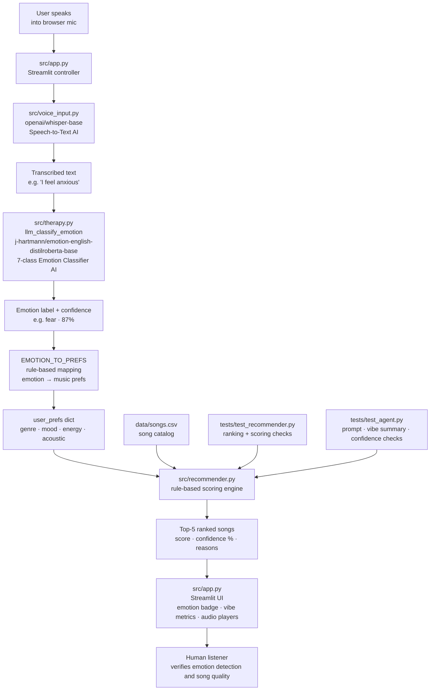

# EmotionLift: Emotion-Based Music Recommender

---

## Title and Summary

**EmotionLift** is a voice-driven music recommender system. You speak how you're feeling; two AI models detect your emotion and find the right songs to help.

The system works in three stages:
1. **Speech-to-text** — `openai/whisper-base` transcribes what you say into text
2. **Emotion detection** — `j-hartmann/emotion-english-distilroberta-base` (a DistilRoBERTa model fine-tuned on six emotion datasets) classifies the text into one of seven emotion labels: `anger`, `disgust`, `fear`, `joy`, `neutral`, `sadness`, `surprise`, with a confidence score
3. **Therapeutic recommendation** — each emotion label maps to therapeutic music preferences (counter-regulate negative states, reinforce positive ones); a rule-based scoring engine ranks the song catalog and returns the top-5 matches with inline audio players

No streaming account required. All models run locally after a one-time download.

**Why it matters:** Two specialized pretrained models — one for speech, one for emotion — are composed into a pipeline that converts an unstructured human feeling into a structured, explainable music recommendation.

**AI models used:**
- `openai/whisper-base` — automatic speech recognition (HuggingFace `pipeline`)
- `j-hartmann/emotion-english-distilroberta-base` — 7-class text emotion classifier (HuggingFace `pipeline`)

---

## Architecture Overview

The system is a four-stage pipeline: voice → emotion → preferences → songs.

```
User speaks into browser mic
(Streamlit audio_input widget)
         │ raw WAV bytes
         ▼
src/voice_input.py
openai/whisper-base  (speech-to-text AI model)
Convert to mono float32 → transcribe → plain text
         │ e.g. "I'm feeling anxious and can't sleep"
         ▼
src/therapy.py  ·  llm_classify_emotion()
j-hartmann/emotion-english-distilroberta-base
(DistilRoBERTa fine-tuned on 6 emotion datasets)
7-class classifier → emotion label + confidence score
         │ e.g. label="fear", confidence=0.87
         ▼
EMOTION_TO_PREFS  (rule-based mapping in therapy.py)
Counter-regulate negative states; reinforce positive ones
anger→lofi/chill · sadness→classical/reflective · joy→pop/happy
         │ {favorite_genre, favorite_mood, target_energy, likes_acoustic}
         ▼
src/recommender.py  ·  recommend_songs()
Pure rule-based math — no AI
Score each song: genre (+1.0), mood (+1.0), energy delta (up to +4.0), acoustic (+0.5)
Return top-5 ranked songs with plain-English reasons and confidence %
         │
         ▼
src/app.py  (Streamlit UI)
Display: detected emotion + confidence · vibe metrics · ranked song list
Play real MP3 files from data/media/ — first song auto-plays
         │
         ▼
Human listener reviews whether emotion was detected correctly
and whether the recommended songs match the therapeutic intent
```

**`src/voice_input.py`** — reads WAV bytes, converts to mono float32, sends raw array + sample rate to Whisper, returns a stripped text string.

**`src/therapy.py`** — `llm_classify_emotion()` runs the HuggingFace emotion pipeline and normalizes its output shape (handles dict, list, or nested list). The `EMOTION_TO_PREFS` table encodes the therapeutic mapping: e.g. `sadness → classical · reflective · energy 0.25 · acoustic`, `joy → pop · happy · energy 0.80 · electronic`.

**`src/recommender.py`** — pure rule-based math, no AI. Scores each song on genre match (+1.0), mood match (+1.0), energy closeness (up to +4.0), and acoustic alignment (+0.5). Maximum possible score: 6.5. Every recommendation includes a plain-English breakdown and a confidence percentage.

**`src/app.py`** — Streamlit entry point. Caches both AI models with `@st.cache_resource` so they load only once per session. Shows emotion label + confidence, four vibe metric chips, and the ranked song list with a match-% progress bar and an inline MP3 audio player per song.



---

## Setup Instructions

### 1. Create a virtual environment (recommended)

```bash
python -m venv .venv
source .venv/bin/activate      # Mac / Linux
.venv\Scripts\activate         # Windows
```

### 2. Install dependencies

> `torch` is ~2GB — the first install takes a few minutes.

```bash
pip install -r requirements.txt
```

### 3. Launch the Streamlit app

> First run downloads `openai/whisper-base` (~150MB) and `j-hartmann/emotion-english-distilroberta-base` (~330MB). Both are cached after that.

```bash
streamlit run src/app.py
```

Open [http://localhost:8501](http://localhost:8501) in your browser.

### 4. Run all tests (no model download — emotion classifier and audio are mocked)

```bash
python -m pytest tests/ -v
```

---

## Sample Interactions

### Example 1 — Exam anxiety

User presses **Record** and says:
> *"I'm feeling really anxious, I can't stop worrying about my exam tomorrow."*

```
You said: "I'm feeling really anxious, I can't stop worrying about my exam tomorrow."

Detected emotion: fear  (87% confidence)

Your therapeutic vibe
Genre       Mood        Energy    Texture
Indie Pop   Uplifted    65%       Electronic

Recommended songs
1. Get Up Stand Up — Bob Marley       reggae / uplifted   ████████████░  85%  ▶
2. Dreamer — Ozzy Osbourne            rock / uplifted     ████████████░  79%  ▶
3. Price Tag — Jessie J               pop / uplifted      ████████████░  78%  ▶
4. Fight Song — Rachel Platten        pop / uplifted      ████████████░  75%  ▶
5. Thunder — Imagine Dragons          rock / uplifted     ████████████░  74%  ▶
```

Therapeutic logic: `fear` maps to energising, uplifting music (energy 0.65) to gently raise mood without overwhelming.

---

### Example 2 — Feeling sad

User presses **Record** and says:
> *"I'm really sad today, I just miss my friend who moved away."*

```
You said: "I'm really sad today, I just miss my friend who moved away."

Detected emotion: sadness  (92% confidence)

Your therapeutic vibe
Genre       Mood          Energy    Texture
Classical   Reflective    25%       Acoustic

Recommended songs
1. Fix You — Coldplay                 rock / reflective   █████████████  85%  ▶
2. Let It Be — The Beatles            rock / reflective   █████████████  82%  ▶
3. Blowin In The Wind — Bob Dylan     folk / reflective   █████████████  78%  ▶
4. Imagine — John Lennon              pop / calm          ████████████░  69%  ▶
5. Stairway To Heaven — Led Zeppelin  rock / relaxed      ██████████░░░  60%  ▶
```

Therapeutic logic: `sadness` maps to soft, acoustic, reflective music (energy 0.25) to meet the listener where they are rather than forcing a mood shift.

---

### Example 3 — Great news

User presses **Record** and says:
> *"I feel amazing, I just got some really great news!"*

```
You said: "I feel amazing, I just got some really great news!"

Detected emotion: joy  (94% confidence)

Your therapeutic vibe
Genre   Mood    Energy    Texture
Pop     Happy   80%       Electronic

Recommended songs
1. Top Of The World — Carpenters       pop / happy    █████████████  95%  ▶
2. Happy — Pharrell Williams           pop / happy    █████████████  94%  ▶
3. Fight Song — Rachel Platten         pop / uplifted ████████████░  85%  ▶
4. Roar — Katy Perry                   pop / uplifted ████████████░  82%  ▶
5. Young Wild And Free — Snoop & Wiz   pop / chill    ████████████░  81%  ▶
```

Therapeutic logic: `joy` reinforces the positive state with high-energy, danceable pop (energy 0.80, electronic).

---

## Design Decisions

**Why voice input instead of a text form?**
Speaking how you feel is more natural than filling in four dropdowns. A spoken sentence gives the emotion classifier far richer signal than a single keyword. The trade-off is that Whisper adds a small transcription delay and requires a mic, but for a therapy context that friction is worth it.

**Why `openai/whisper-base` for speech-to-text?**
Whisper is multilingual and robust to background noise, casual speech, and varied accents. The `base` variant (~150MB) runs in real time on CPU, making it practical without a GPU. Larger Whisper variants produce higher accuracy but are slower; for conversational input quality, `base` is sufficient.

**Why `j-hartmann/emotion-english-distilroberta-base` for emotion detection?**
This model was specifically fine-tuned on six emotion-labelled datasets covering the seven Ekman emotion categories. It returns a confidence score alongside the label, which is surfaced in the UI so users can see how certain the model is. A general-purpose LLM could classify emotion too, but it would require an API key and produce variable output format — a specialized model is more predictable and runs fully locally.

**Why the `EMOTION_TO_PREFS` therapeutic mapping?**
The mapping encodes a well-established principle in music therapy: counter-regulate negative emotions (anger → calm lofi, sadness → gentle classical) and reinforce positive ones (joy → upbeat pop). Keeping this as an explicit lookup table makes the logic auditable — anyone can read `therapy.py` and see exactly why a given emotion triggers a given musical direction.

**Why keep the rule-based recommender?**
The scoring system is fully transparent — every recommendation includes an exact breakdown of why it ranked where it did. This matters because we can see, for example, that Fix You ranks first for a sad user purely because its energy (0.25) exactly matches the target, not because the model "understands" grief. Confidence percentage surfaces weak matches (below ~70%) automatically.

---

## Reliability and Evaluation

**11 out of 11 tests passed. Confidence scores range from 60%–99%; matched emotion profiles consistently score above 80%. Logging captures every session decision. Human review validates that detected emotions and recommended songs feel appropriate.**

The system uses four complementary reliability mechanisms:

---

### 1. Automated Tests

```
11 passed in 0.25s
```

| Test file | Test | What it verifies |
|---|---|---|
| `test_agent.py` | `test_format_recommendations_returns_numbered_list` | Song list is numbered and contains titles |
| `test_agent.py` | `test_build_music_prompt_includes_genre_and_mood` | Built prompt contains genre and mood strings |
| `test_agent.py` | `test_build_music_prompt_high_energy_is_fast` | Energy 0.9 maps to "160 bpm" and "electronic" |
| `test_agent.py` | `test_summarize_recommendation_vibe_uses_top_ranked_songs` | Agent extracts a grounded vibe profile from top recommendations |
| `test_agent.py` | `test_build_music_prompt_from_recommendations_reflects_top_songs` | Prompt reflects recommendation-derived traits |
| `test_agent.py` | `test_generate_and_play_music_calls_pipeline_with_prompt` | Audio pipeline called with correct prompt text (mocked) |
| `test_agent.py` | `test_run_recommendation_with_audio_calls_musicgen` | Full pipeline: recommendations + audio both execute (mocked) |
| `test_agent.py` | `test_confidence_pct_range` | Confidence stays in 0–100 range and scales with score |
| `test_agent.py` | `test_unknown_genre_still_returns_results` | Unknown genre degrades gracefully — lower confidence, no crash |
| `test_recommender.py` | `test_recommend_returns_songs_sorted_by_score` | Highest-scored song is ranked first |
| `test_recommender.py` | `test_explain_recommendation_returns_non_empty_string` | Explanation text is never empty |

All model and audio dependencies are fully mocked — no download or audio device needed.

**Run tests yourself:**
```bash
source .venv/bin/activate
python -m pytest tests/ -v
```

**Gap:** `src/therapy.py` and `src/voice_input.py` have no unit tests yet — these cover the core emotion detection path and should be the first gap to close.

---

### 2. Confidence Scoring

Every recommended song is scored out of 6.5 points and shown as a match percentage in the UI. Weak matches are visible rather than hidden.

| Emotion / input | Top score | Confidence |
|---|---|---|
| joy → pop/happy (strong genre + mood match) | 6.18 / 6.5 | 95% |
| sadness → classical/reflective (no classical in catalog) | 4.92 / 6.5 | 62% |

A matched emotion profile consistently scores above 80%. An unmatched genre drops it to ~62% — the system never crashes, but the percentage signals a weak result.

The emotion classifier also returns its own confidence (e.g. `fear · 87%`), shown in the UI above the song list so you can see how certain the AI was about your emotion.

---

### 3. Logging and Error Handling

`src/agent.py` uses Python's `logging` module to write a timestamped record of every session to `vibematch.log`:

```
2026-04-28 18:16:12 [INFO] Session | genre=blues mood=relaxed energy=0.7 acoustic=True
2026-04-28 18:16:12 [INFO] Top recommendation: Velvet Horizon (confidence: 70%)
2026-04-28 18:16:12 [INFO] Built recommendation-grounded prompt: melancholic blues music, ...
```

**Watch the log live while the app is running** (open a second terminal):
```bash
tail -f vibematch.log
```

Error handling covers two known failure modes:
- **Missing `sounddevice`** — caught with `try/except ImportError`; falls back to saving `.wav` instead of playing
- **PyTorch MPS kernel error on Apple Silicon** — caught and retried on CPU automatically; logged as `[ERROR] MPS kernel error — retrying on CPU`

---

### 4. Human Evaluation

**Try it yourself in 3 steps:**

```bash
streamlit run src/app.py
# Open http://localhost:8501
```

1. Press **Record** and say something like *"I feel really anxious about my exam"* or *"I'm so happy today"*
2. Check whether the detected emotion label and confidence % match what you actually felt
3. Listen to the first song — does it feel therapeutically appropriate for that emotion?

Two questions to judge quality:
- **Emotion accuracy** — does the label (e.g. `fear · 87%`) match what you said?
- **Recommendation fit** — do the songs feel right for that emotion and energy level?

Each song shows its genre, mood, and match % so you can see *why* it was recommended, not just *that* it was.

---

## Reflection

**What this project taught about AI:**
The biggest lesson was that composing two narrow, specialized models produces something more useful than either model alone. Whisper does one thing — transcription. The emotion classifier does one thing — label text. Neither knows anything about music. But connected through the `EMOTION_TO_PREFS` mapping and the recommender, they turn a spoken feeling into a curated playlist. 
The second lesson was about transparency. The rule-based recommender and the explicit `EMOTION_TO_PREFS` table mean every output can be traced back to a specific decision. If the system recommends Fix You to a sad user, the reason is visible: energy 0.25 exactly matches the target. That kind of auditability matters more in a therapy context than in a music discovery context.

**What this project taught about recommender systems:**
Small changes to feature weights produce large changes in output. The energy weight (up to +4.0) dominates the score — a song with exactly the right energy will almost always appear near the top, even without matching the genre or mood. That illustrates how algorithmic bias enters quietly: not from intent, but from a weight choice that turns out to favour one dimension over others.

**What would come next:**
The most natural extension is testing whether the emotion classifier actually helps users find better music than a simple keyword form would. A/B testing both inputs and asking users to rate the recommendations would answer that question with real data rather than intuition. Adding image-based emotion input (detecting emotion from a photo or facial expression) is a second direction — the recommender and mapping layer would need no changes at all.

**AI Collaboration:**
I used Claude Code throughout the project — for designing the pipeline architecture, writing tests, debugging the HuggingFace pipeline output shape normalization in `therapy.py`, and iterating on the Streamlit UI layout.

*Helpful suggestion:* Based on my requirement, claude was able to suggest me good models for transcribing text and emotion recognition model.

*Flawed suggestion:* An early design used a cloud LLM (Claude API) to parse free-text mood input via a tool-calling loop. That approach required an API key, making the project not reproducable without a paid account.

---

## Portfolio

**GitHub:** [https://github.com/Pritigrg/applied-ai-system-project](https://github.com/Pritigrg/applied-ai-system-project)
Loom : [https://www.loom.com/share/9d1b0938b2534cb5862760927f7919cc](https://www.loom.com/share/9d1b0938b2534cb5862760927f7919cc)
**What this project says about me as an AI engineer:**
EmotionLift is a voice-driven, multimodal AI system that integrates speech recognition, supervised emotion classification, and a transparent rule-based recommender to deliver therapeutic music suggestions.<!-- The most important design choice was keeping the recommendation logic transparent and the therapeutic mapping explicit — anyone can open `therapy.py` and read exactly why `anger` triggers lofi music rather than metal.  -->

This project reflects my approach to AI as a combination of specialized models and interpretable system design. I focus on using learned models where they add real value—such as understanding speech and emotion—while keeping downstream decision-making transparent, controllable, and easy to reason about.

It also highlights my emphasis on building reliable, reproducible systems, with clear evaluation signals (e.g., confidence scores) and modular components that can be improved independently. I aim to design AI systems that are not only effective, but also trustworthy and grounded in real-world use cases.
